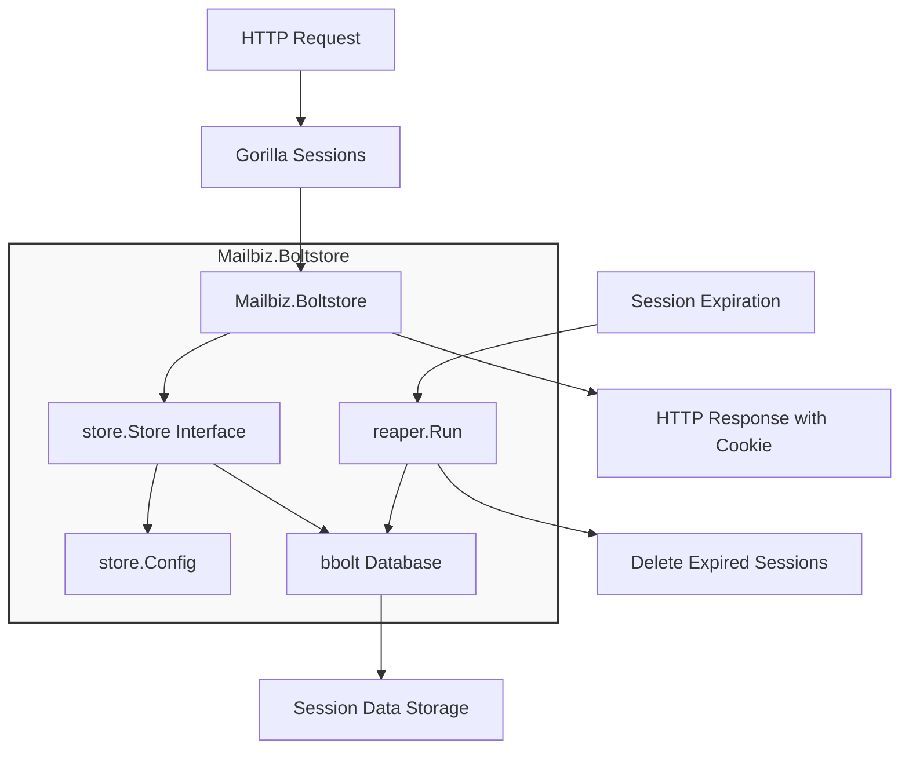

# Mailbiz.Boltstore - Session store using bbolt

## Overview

Mailbiz.Boltstore is a session store using [bbolt](https://github.com/etcd-io/bbolt) (formerly Bolt), a pure Go key/value store. This store implements the [gorilla/sessions](https://github.com/gorilla/sessions) package's Store interface for session management.

This is a fork of the original [BoltStore](https://github.com/yosssi/boltstore) project, updated to use modern dependencies and maintained by Mailbiz.

## Installation

```go
go get Mailbiz.Boltstore/...
```

## Example

```go
package main

import (
	"fmt"
	"net/http"

	"go.etcd.io/bbolt"
	"github.com/gorilla/sessions"
	"Mailbiz.Boltstore/reaper"
	"Mailbiz.Boltstore/store"
)

var db *bbolt.DB

func handler(w http.ResponseWriter, r *http.Request) {
	// Create a store
	str, err := store.New(db, store.Config{}, []byte("secret-key"))
	if err != nil {
		http.Error(w, err.Error(), http.StatusInternalServerError)
		return
	}

	// Get a session
	session, err := str.Get(r, "session-key")
	if err != nil {
		http.Error(w, err.Error(), http.StatusInternalServerError)
		return
	}

	// Add a value to the session
	session.Values["foo"] = "bar"

	// Save the session
	if err := session.Save(r, w); err != nil {
		http.Error(w, err.Error(), http.StatusInternalServerError)
		return
	}

	fmt.Fprintf(w, "Hello Mailbiz.Boltstore")
}

func main() {
	var err error
	// Open a bbolt database
	db, err = bbolt.Open("./sessions.db", 0666, nil)
	if err != nil {
		panic(err)
	}
	defer db.Close()
	
	// Invoke a reaper which checks and removes expired sessions periodically
	defer reaper.Quit(reaper.Run(db, reaper.Options{}))
	
	http.HandleFunc("/", handler)
	http.ListenAndServe(":8080", nil)
}
```

## Dependencies

- Go 1.23+
- github.com/gorilla/sessions v1.4.0
- github.com/gorilla/securecookie v1.1.2
- go.etcd.io/bbolt v1.4.0
- github.com/gogo/protobuf v1.3.2

## Directory Structure

```
Mailbiz.Boltstore/
├── LICENSE
├── Makefile
├── README.md
├── go.mod
├── go.sum
├── reaper/
│   ├── doc.go            # Documentation for the reaper package
│   ├── options.go        # Configuration options for the reaper
│   ├── options_test.go   # Tests for reaper options
│   ├── reaper.go         # Implementation of session cleanup mechanism
│   └── reaper_test.go    # Tests for the reaper functionality
├── shared/
│   ├── consts.go         # Shared constants
│   ├── doc.go            # Documentation for the shared package
│   ├── protobuf/         # Protocol buffer definitions and generated code
│   │   ├── session.pb.go
│   │   ├── session.pb_test.go
│   │   └── session.proto
│   ├── utils.go          # Shared utility functions
│   └── utils_test.go
└── store/
    ├── config.go         # Configuration for the session store
    ├── config_test.go
    ├── doc.go            # Documentation for the store package
    ├── options.go        # Options for configuring the store
    ├── store.go          # Main implementation of the session store
    └── store_test.go
```

## Workflow Diagram



The workflow shows how HTTP requests are processed through Gorilla Sessions, which uses Mailbiz.Boltstore to persist session data in a bbolt database. The reaper component periodically scans the database and removes expired sessions to prevent unlimited growth of the database file.
